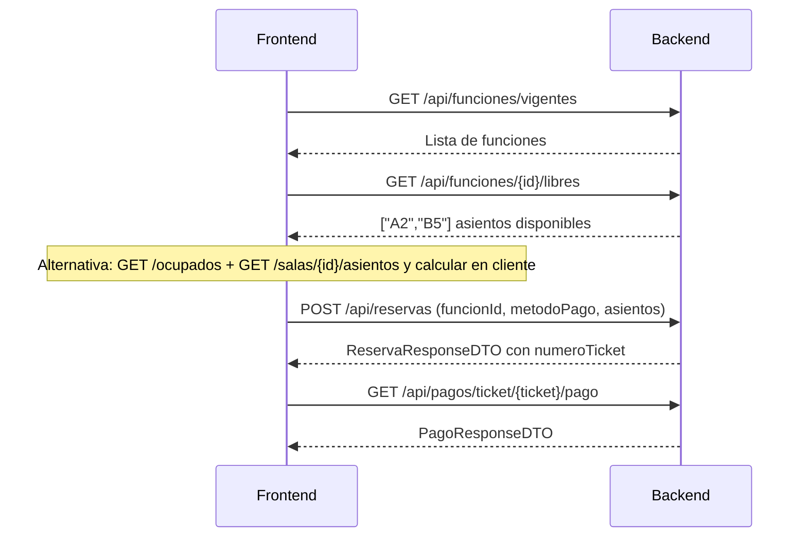

# Gestor Cinemar Center — Documentación de la API

Referencia completa del backend Spring Boot para integrar un frontend. Describe contratos fijos: endpoints, DTOs, validaciones, reglas de negocio y flujos de uso.

---

## Tabla de contenidos

1. [Restricciones de uso](#1-restricciones-de-uso)
2. [Introducción y arquitectura](#2-introducción-y-arquitectura)
3. [Autenticación JWT](#3-autenticación-jwt)
4. [Seguridad y matriz de acceso](#4-seguridad-y-matriz-de-acceso)
   - [401 vs 403](#401-vs-403)
   - [Mensajes 403 por rol](#mensajes-403-por-rol)
5. [Formato de errores y validaciones](#5-formato-de-errores-y-validaciones)
   - [Validación en capas (@Valid y @Validated)](#51-validación-en-capas-valid-y-validated)
6. [Modelo de datos](#6-modelo-de-datos)
7. [Referencia de endpoints](#7-referencia-de-endpoints)
8. [Reglas de negocio por módulo](#8-reglas-de-negocio-por-módulo)
9. [Flujos recomendados para el frontend](#9-flujos-recomendados-para-el-frontend)
10. [Enums y convenciones](#10-enums-y-convenciones)
11. [Apéndice: Request DTOs](#apéndice-request-dtos)
12. [Apéndice: Resumen de endpoints](#apéndice-resumen-de-endpoints-63)

---

## 1. Restricciones de uso

> **Importante para el desarrollo del frontend**

- **Los endpoints no son modificables.** Las rutas, métodos HTTP, parámetros, cuerpos de request/response y códigos de estado están definidos y no deben alterarse.
- **El código del backend no es modificable** para adaptar la UI. No se agregan campos, no se cambian validaciones ni se adaptan respuestas desde el cliente.
- **El frontend debe consumir exclusivamente los recursos expuestos por la API** tal como se documentan aquí: DTOs, enums, mensajes de error y reglas de negocio.
- Cualquier necesidad de presentación (filtros adicionales, agrupaciones, formatos visuales, caché local) se resuelve **en el cliente** con los datos devueltos por los endpoints existentes.
- Si un dato no está disponible en ningún endpoint, **no se puede obtener** modificando el backend; se debe trabajar con lo que la API entrega.

**Configuración de conexión:**

| Parámetro | Valor |
|-----------|-------|
| Base URL | `http://localhost:8080` |
| CORS permitido | `http://localhost:4200` |
| Header de autenticación | `Authorization: Bearer <token>` |
| Swagger UI (consulta) | `http://localhost:8080/swagger-ui.html` |

---

## 2. Introducción y arquitectura

**Gestor Cinemar Center** es una API REST construida con Spring Boot y MySQL para la gestión de un cine: catálogo de películas, programación de funciones, salas, reservas, pagos, estadísticas y personalización visual.

### Capas del sistema

```
Controller  →  Service  →  Repository  →  Entity (JPA)
     ↓              ↓
   DTOs         Reglas de negocio
```

### Conceptos clave

- **Borrado lógico:** películas, salas, funciones y usuarios no se eliminan físicamente; se marcan como inactivos (`activa = false` o `estado = INACTIVO`) y dejan de aparecer en listados operativos.
- **Pagos automáticos:** al crear una reserva (`POST /api/reservas`) se genera automáticamente un pago asociado. No existe endpoint público para crear pagos manualmente.
- **Identificación por JWT:** en reservas y pagos propios, el cliente se identifica por el email del token, no por un `clienteId` en el body.
- **Archivos estáticos:** imágenes servidas en `/uploads/**` (público). Las rutas en respuestas son relativas; concatenar con la base URL. Ejemplo: `/uploads/peliculas/abc.jpg` → `http://localhost:8080/uploads/peliculas/abc.jpg`.

### Estructura de `/uploads/`

| Carpeta | Origen | Ejemplo de ruta en respuesta |
|---------|--------|------------------------------|
| `peliculas/` | `POST /api/peliculas/{id}/imagen` | `/uploads/peliculas/{uuid}.jpg` |
| `logos/` | `POST /api/customizacion/logo` | `/uploads/logos/{uuid}_{nombre}` |
| `fondos/` | `POST /api/customizacion/fondo` | `/uploads/fondos/{uuid}_{nombre}` |

Todas las rutas se sirven vía `GET /uploads/**` sin autenticación.

### Tecnologías

- Spring Boot, Spring Security (JWT stateless), Spring Data JPA
- MySQL (`cine_db2`)
- Validación Bean Validation (Jakarta)
- MapStruct para mapeo DTO ↔ Entity

---

## 3. Autenticación JWT

### Flujo

1. El usuario hace login o registro → recibe `AuthResponse` con token.
2. En cada request protegido, enviar: `Authorization: Bearer <token>`.
3. El token expira en **24 horas** (`jwt.expiration: 86400000` ms).

### AuthResponse

```json
{
  "token": "eyJhbGciOiJIUzI1NiIsInR5cCI6IkpXVCJ9...",
  "tipo": "CLIENTE",
  "email": "cliente@mail.com",
  "nombre": "Juan Pérez",
  "id": 1
}
```

| Campo | Tipo | Descripción |
|-------|------|-------------|
| `token` | String | JWT para autenticación |
| `tipo` | String | Rol del usuario: `CLIENTE` o `ADMINISTRADOR` |
| `email` | String | Email del usuario |
| `nombre` | String | Nombre completo (nombre + apellido) |
| `id` | Long | ID del usuario |

El esquema HTTP del header de autenticación es siempre `Authorization: Bearer <token>`. El campo `tipo` en `AuthResponse` **no** es `"Bearer"`; contiene el rol del usuario.

El claim de rol en el JWT es `ADMINISTRADOR` o `CLIENTE` (usado internamente por Spring Security).

### Errores de autenticación

| Código | Situación | Mensaje típico |
|--------|-----------|----------------|
| 401 | Credenciales incorrectas | `"Email o contraseña incorrectos"` |
| 401 | Sin token en ruta protegida | Mensaje del entry point JSON |
| 403 | Cuenta inactiva/bloqueada | `"La cuenta de usuario no está activa"` |
| 403 | Rol insuficiente | Mensaje en español según rol y endpoint |

---

## 4. Seguridad y matriz de acceso

Spring Security aplica reglas en orden. Rutas no listadas explícitamente devuelven **403** (`.anyRequest().denyAll()`).

### Público (sin token)

| Método | Ruta |
|--------|------|
| GET | `/api/peliculas`, `/api/peliculas/vigentes`, `/api/peliculas/proximamente` |
| GET | `/api/customizacion` |
| POST | `/api/auth/login`, `/api/auth/registro` |
| GET | `/uploads/**` |
| GET | `/swagger-ui/**`, `/v3/api-docs/**` |

### Autenticado (cualquier rol con token válido)

| Método | Ruta |
|--------|------|
| GET | `/api/peliculas/**` (detalle, filtros) |
| GET | `/api/funciones`, `/api/funciones/vigentes` |
| GET | `/api/funciones/**` (detalle, por película, ocupados, libres) |
| GET | `/api/salas/**` |

### Solo CLIENTE

| Método | Ruta |
|--------|------|
| POST | `/api/reservas` |
| GET | `/api/reservas/mis` |
| GET | `/api/pagos/mis` |

### CLIENTE o ADMINISTRADOR

| Método | Ruta |
|--------|------|
| GET | `/api/reservas/ticket/**` |
| DELETE | `/api/reservas/ticket/**` |
| GET | `/api/pagos/ticket/{numeroTicket}/pago` |
| PUT | `/api/usuarios/mi-nombre` |

### Solo ADMINISTRADOR

| Método | Ruta |
|--------|------|
| POST | `/api/auth/registro-admin` |
| POST/PUT/DELETE | `/api/peliculas/**` |
| POST/PUT/DELETE | `/api/funciones/**` |
| POST/PUT/DELETE | `/api/salas/**` |
| POST/PUT/DELETE | `/api/customizacion/**` |
| GET | `/api/reservas/admin/**`, `/api/reservas/cliente/**` |
| POST | `/api/reservas/validar/**` |
| GET | `/api/estadisticas/**` |
| GET | `/api/pagos/**` (excepto `/mis` y `/ticket/*/pago`) |
| GET/DELETE | `/api/usuarios/**` (excepto `PUT /mi-nombre`) |

### Reglas en SecurityConfig sin endpoint implementado

Estas rutas están autorizadas en `SecurityConfig` pero **no tienen controller** asociado:

| Método | Ruta | Nota |
|--------|------|------|
| POST | `/api/pagos/**` | Los pagos se crean automáticamente al reservar |
| PUT | `/api/reservas/ticket/**` | No existe endpoint PUT en `ReservaController` |

### 401 vs 403

| Código | Significado | Cuándo ocurre |
|--------|-------------|---------------|
| **401** Unauthorized | No autenticado o token inválido | Sin header `Authorization`, token expirado/malformado, credenciales incorrectas en login |
| **403** Forbidden | Autenticado pero sin permiso | Token válido pero el rol no alcanza para ese endpoint |

Un token JWT válido con rol `CLIENTE` que intenta `POST /api/funciones` recibe **403**, no 401.

### Mensajes 403 por rol

Los mensajes provienen de `AccesoDenegadoMensaje` y se devuelven en el campo `message` del `ErrorResponse`.

| Contexto | Rol del usuario | Mensaje 403 |
|----------|-----------------|-------------|
| `POST /api/reservas` | ADMINISTRADOR | `"Solo los clientes pueden crear reservas."` |
| `GET /api/reservas/mis` | ADMINISTRADOR | `"No tiene permisos para realizar esta operación."` |
| `GET /api/pagos/mis` | ADMINISTRADOR | `"No tiene permisos para realizar esta operación."` |
| `POST /api/pagos/**` | ADMINISTRADOR | `"Solo los clientes pueden registrar pagos."` |
| `POST /api/auth/registro-admin` | CLIENTE | `"Solo los administradores pueden registrar nuevos administradores."` |
| POST/PUT/DELETE `/api/peliculas/**` | CLIENTE | `"Solo los administradores pueden gestionar películas."` |
| POST/PUT/DELETE `/api/funciones/**` | CLIENTE | `"Solo los administradores pueden gestionar funciones."` |
| POST/PUT/DELETE `/api/salas/**` | CLIENTE | `"Solo los administradores pueden gestionar salas."` |
| POST/PUT/DELETE `/api/customizacion/**` | CLIENTE | `"Solo los administradores pueden modificar la personalización del sitio."` |
| `GET /api/estadisticas/**` | CLIENTE | `"Solo los administradores pueden consultar estadísticas."` |
| `GET /api/pagos` o `GET /api/pagos/{id}` | CLIENTE | `"Solo los administradores pueden consultar pagos."` |
| `/api/usuarios/**` (excepto `PUT /mi-nombre`) | CLIENTE | `"Solo los administradores pueden gestionar usuarios."` |
| `/api/reservas/admin/**`, `/api/reservas/cliente/**`, `POST /api/reservas/validar/**` | CLIENTE | `"Solo los administradores pueden acceder a la gestión de reservas."` |
| Cualquier otro caso sin permiso | Cualquiera | `"No tiene permisos para realizar esta operación."` |

---

## 5. Formato de errores y validaciones

### ErrorResponse (todas las respuestas de error)

```json
{
  "timestamp": "2026-06-14T10:30:00",
  "status": 400,
  "error": "Bad Request",
  "message": "El horario debe ser futuro",
  "path": "/api/funciones",
  "fieldErrors": [
    { "field": "horario", "message": "El horario debe ser futuro" }
  ]
}
```

`fieldErrors` solo aparece en errores de validación Bean (400).

### Mapa de códigos HTTP

| Código | Origen | Cuándo |
|--------|--------|--------|
| 400 | `ReglaNegocioException` | Regla de negocio incumplida |
| 400 | `MethodArgumentNotValidException` | Validación Bean en body |
| 400 | `ConstraintViolationException` | Validación en path/query params |
| 400 | `IllegalArgumentException`, `IOException` | Argumentos o archivos inválidos |
| 401 | `BadCredentialsException` | Login fallido |
| 401 | `InsufficientAuthenticationException` | Sin autenticación |
| 403 | `AccessDeniedException` | Rol insuficiente |
| 403 | `DisabledException` | Usuario inactivo/bloqueado |
| 404 | `RecursoNoEncontradoException` | Recurso no existe o está inactivo |
| 409 | `ConflictoRecursoException` | Email/teléfono duplicado, asiento ocupado |
| 409 | `DataIntegrityViolationException` | Violación de integridad en BD |
| 500 | `Exception`, `GuardadoImagenException` | Error inesperado o fallo al guardar imagen |

### Validadores custom

| Anotación | Aplica a | Regla |
|-----------|----------|-------|
| `@ValidTelefonoArgentino` | `telefono` | Formato internacional argentino (`+54 9 ...`). Normaliza a dígitos con prefijo `549`, longitud 13. Rechaza secuencias triviales. |
| `@ValidGeneroPelicula` | `genero` | Debe ser un valor de `GeneroPelicula`. Null/blank pasa (en updates). |
| `@ValidMetodoPago` | `metodoPago` | Debe ser `EFECTIVO`, `TARJETA`, `MERCADO_PAGO` o `TRANSFERENCIA`. |
| `@ValidAsientoEtiqueta` | cada asiento | Regex `^[A-T][1-9][0-9]?$` (ej. `A1`, `B12`, máx fila T). |
| `@UniqueElements` | lista de asientos | Sin duplicados (case-insensitive). |
| `@FechasPeliculaValidas` | DTO película | `fechaSalida` > `fechaEstreno`. |
| `@CapacidadSalaValida` | DTO sala | `filas × columnas ≤ 320` cuando ambos están presentes. |
| `@RangoFuncionesValido` | DTO funciones por rango | `fechaHasta ≥ fechaDesde`; `horaFin > horaInicio`. Archivos: `validation/interfaces/RangoFuncionesValido.java`, `validation/impl/RangoFuncionesValidatorImpl.java`. **fieldErrors:** `fechaHasta` → `"La fecha hasta debe ser igual o posterior a la fecha desde"`; `horaFin` → `"La hora de fin debe ser posterior a la hora de inicio"`. |
| `@NotBlankIfPresent` | campos opcionales en updates | Si el campo no es null, no puede estar vacío. |

### Validadores de customización (inactivos en código)

Los siguientes validadores existen en el proyecto pero están **comentados** en `CustomizacionRequest.java` y no se aplican actualmente:

| Anotación | Regla (si estuviera activa) |
|-----------|----------------------------|
| `@ValidHexColor` | `#RGB` o `#RRGGBB`. Null/blank pasa. |
| `@ValidCssSize` | `^\d{1,3}(px\|%|rem)$`. Null/blank pasa. |
| `@ValidResourceUrl` | `/uploads/...` (sin `..`) o `http(s)://`. Bloquea `javascript:` y `data:`. |

### Validaciones activas de `CustomizacionRequest`

| Campo | Validación activa |
|-------|-------------------|
| `logoUrl`, `fondoUrl` | `@Size(max=500)` |
| `logoOpacity`, `globalOpacity` | `@Pattern` — valor string `"0"` a `"100"` |
| `colorFondo`, `colorContenedor`, `colorFuente`, `colorSlider`, `tamanoFuenteTitulos`, `tamanoFuenteTexto`, `logoTamano` | Sin validación Bean (todos opcionales) |

Todos los campos de `CustomizacionRequest` son opcionales.

### 5.1 Validación en capas (@Valid y @Validated)

El backend valida en dos niveles:

| Mecanismo | Dónde aplica | Ejemplo |
|-----------|--------------|---------|
| `@Valid` en `@RequestBody` | Campos del JSON del body | `CrearReservaRequestDTO`, `CrearFuncionesPorRangoRequestDTO` |
| `@Validated` en el controller | `@PathVariable`, `@RequestParam` | `@Positive` en `{id}`, `@Pattern(regexp = "^TK\\d+$")` en tickets, `@Min/@Max` en `dias` de estadísticas |

**Errores de body** → `MethodArgumentNotValidException` → 400 con `fieldErrors` por campo del DTO.

**Errores de path/query** → `ConstraintViolationException` → 400 con `fieldErrors` (el nombre del campo suele ser el parámetro, ej. `numeroTicket`, `id`, `dias`).

Los validadores de clase (`@RangoFuncionesValido`, `@FechasPeliculaValidas`, etc.) también devuelven `fieldErrors` en el campo indicado por el validador.

---

## 6. Modelo de datos

### Diagrama de relaciones

```
Usuario (abstracto, SINGLE_TABLE)
 ├── Administrador
 └── Cliente ──< Reserva >── Funcion ──> Sala
                      │         │
                      │         └──> Pelicula
                      ├──> Pago (1:1 por reserva)
                      └──<> Asiento (ManyToMany via reserva_asiento)

Sala ──< Asiento (generados automáticamente: fila A-T, columna 1-N)

Customizacion (registro único de tema visual)
```

### Entidades principales

#### Usuario (abstracta)

| Campo | Tipo | Notas |
|-------|------|-------|
| `id` | Long | PK |
| `nombre`, `apellido` | String | |
| `email` | String | Único, case-insensitive |
| `password` | String | BCrypt hash |
| `telefono` | String | Único, normalizado |
| `tipo` | TipoUsuario | `ADMINISTRADOR` / `CLIENTE` |
| `estado` | EstadoUsuario | Default `ACTIVO` |
| `fechaRegistro`, `fechaUltimoAcceso` | LocalDateTime | |
| `intentosFallidos` | Integer | Default 0 |

**Cliente** agrega: `puntosFidelidad` (Integer, default 0).

**Administrador** agrega: `nivelAcceso` (String, default `"AVANZADO"`).

#### Pelicula

| Campo | Tipo | Notas |
|-------|------|-------|
| `id` | Long | |
| `nombre` | String | Único entre activas (case-insensitive) |
| `fechaEstreno`, `fechaSalida` | LocalDate | Rango de cartelera |
| `duracionMinutos` | Integer | Usada para calcular solapamientos |
| `genero` | GeneroPelicula | |
| `rutaImagen` | String | Ruta relativa `/uploads/...` |
| `activa` | boolean | Default true |

#### Sala

| Campo | Tipo | Notas |
|-------|------|-------|
| `id` | Long | |
| `nombre` | String | Único entre activas |
| `filas` | Integer | Máx 20 |
| `columnas` | Integer | Máx 16 |
| `capacidad` | Integer | `filas × columnas`, máx 320 |
| `activa` | boolean | |

Etiquetas de asientos: fila `A` = fila 1, `B` = fila 2, etc. Columna = número (`A1`, `A2`...).

#### Funcion

| Campo | Tipo | Notas |
|-------|------|-------|
| `id` | Long | |
| `sala` | Sala | ManyToOne |
| `pelicula` | Pelicula | ManyToOne |
| `horario` | LocalDateTime | Inicio de la proyección |
| `precio` | Double | Default 5000.0 |
| `activa` | boolean | |

Fin de función = `horario + pelicula.duracionMinutos`.

#### Reserva

| Campo | Tipo | Notas |
|-------|------|-------|
| `id` | Long | |
| `numeroTicket` | String | Formato `TK` + timestamp, único |
| `codigoOR` | String | `OR-CMX-` + parte numérica del ticket |
| `cliente` | Cliente | ManyToOne |
| `funcion` | Funcion | ManyToOne |
| `montoTotal` | Double | `precio × cantidad asientos` |
| `metodoPago` | String | Enum como string |
| `fechaEmision` | LocalDateTime | |
| `fechaValidacion` | LocalDateTime | Se setea al validar ticket |
| `estadoReserva` | EstadoReserva | Default `CONFIRMADA` al crear |
| `asientos` | List\<Asiento\> | ManyToMany |

#### Pago

| Campo | Tipo | Notas |
|-------|------|-------|
| `id` | Long | |
| `reserva` | Reserva | ManyToOne, 1 pago por reserva |
| `monto` | Double | |
| `metodoPago` | MetodoPago | |
| `fechaPago` | LocalDateTime | |
| `estadoPago` | EstadoPago | Default `COMPLETADO` |

> **Nota:** no existe campo `transaccionId` en la entidad ni en `PagoResponseDTO` (se eliminó al no integrar pasarela de pago real). La API expone solo: `id`, `numeroTicket`, `monto`, `metodoPago`, `estado`, `fechaPago`.

#### Customizacion (registro único)

Campos de tema: `logoUrl`, `fondoUrl`, colores hex (`colorFondo`, `colorContenedor`, `colorFuente`, `colorSlider`), tamaños CSS (`tamanoFuenteTitulos`, `tamanoFuenteTexto`, `logoTamano`), opacidades (`logoOpacity`, `globalOpacity` como string 0-100).

---

## 7. Referencia de endpoints

Convenciones:
- **Rol:** quién puede llamar el endpoint.
- **Validación DTO:** reglas Bean en el body.
- **Reglas de negocio:** validaciones del service (400 o 409).
- Fechas: `yyyy-MM-dd`. Fecha-hora: `yyyy-MM-dd'T'HH:mm:ss`.

---

### 7.1 Autenticación — `/api/auth`

#### POST `/api/auth/login`

| | |
|---|---|
| **Rol** | Público |
| **Body** | `LoginRequest` |

**Request:**

| Campo | Tipo | Validación |
|-------|------|------------|
| `email` | String | Obligatorio, email válido, máx 255 |
| `password` | String | Obligatorio, 6-100 caracteres |

**Response 200:** `AuthResponse`

**Errores:** 400 (validación), 401 (credenciales incorrectas), 403 (cuenta inactiva)

---

#### POST `/api/auth/registro`

| | |
|---|---|
| **Rol** | Público |
| **Body** | `RegistroRequest` |

**Request:**

| Campo | Tipo | Validación |
|-------|------|------------|
| `nombre` | String | Obligatorio, máx 100, solo letras/espacios `.'-` |
| `apellido` | String | Igual que nombre |
| `email` | String | Obligatorio, email válido, máx 255 |
| `password` | String | Obligatorio, 6-100 caracteres |
| `telefono` | String | Obligatorio, `@ValidTelefonoArgentino`, máx 30 |

**Response 200:** `AuthResponse` (crea CLIENTE y devuelve token)

**Errores:** 400 (validación/teléfono), 409 (`"El email ya está registrado"`, `"El teléfono ingresado ya se encuentra registrado"`)

---

#### POST `/api/auth/registro-admin`

| | |
|---|---|
| **Rol** | ADMINISTRADOR |
| **Body** | `RegistroRequest` (mismos campos que registro) |

**Response 200:** `AuthResponse` (crea ADMINISTRADOR)

**Errores:** 400, 403, 409

---

### 7.2 Usuarios — `/api/usuarios`

La gestión administrativa requiere **ADMINISTRADOR**. La actualización del propio nombre está disponible para **CLIENTE** y **ADMINISTRADOR**.

#### PUT `/api/usuarios/mi-nombre`

| | |
|---|---|
| **Rol** | CLIENTE o ADMINISTRADOR |
| **Identificación** | Email del JWT |
| **Body** | `ActualizarNombreUsuarioRequestDTO` |

**Request:**

| Campo | Tipo | Validación |
|-------|------|------------|
| `nombre` | String | Obligatorio, máx 20, solo letras/espacios `.'-` (sin caracteres especiales consecutivos) |
| `apellido` | String | Igual que nombre |

**Response 200:** `UsuarioResponseDTO`

**Errores:** 400 (validación), 403 (cuenta inactiva)

---

#### GET `/api/usuarios`

**Response 200:** `List<UsuarioResponseDTO>`

`UsuarioResponseDTO`: `id`, `nombre`, `apellido`, `email`, `telefono`, `tipo` (TipoUsuario), `estado` (EstadoUsuario), `fechaRegistro`, `fechaUltimoAcceso`

---

#### GET `/api/usuarios/{id}`

| Parámetro | Tipo | Validación |
|-----------|------|------------|
| `id` | Long | `@Positive` |

**Response 200:** `UsuarioResponseDTO` | **404:** usuario no encontrado

---

#### GET `/api/usuarios/buscar?nombre={texto}`

| Parámetro | Tipo | Descripción |
|-----------|------|-------------|
| `nombre` | String | Busca en nombre o apellido (contains, case-insensitive) |

**Response 200:** `List<UsuarioResponseDTO>`

---

#### GET `/api/usuarios/rol/{rol}`

| Parámetro | Tipo | Validación |
|-----------|------|------------|
| `rol` | String | `CLIENTE` o `ADMINISTRADOR` |

**Response 200:** `List<UsuarioResponseDTO>`

---

#### DELETE `/api/usuarios/{id}`

| | |
|---|---|
| **Rol** | ADMINISTRADOR |
| **Path** | `id` (Long, `@Positive`) |
| **Identificación** | Email del administrador autenticado (no puede desactivarse a sí mismo) |
| **Efecto** | Borrado lógico (`estado = INACTIVO`) |

**Errores 400:** `"No puede desactivar su propia cuenta"`, `"El usuario ya está inactivo"`, `"No se puede desactivar el usuario porque tiene reservas activas con funciones futuras"`

**Response 200:** `{ "message": "Usuario desactivado correctamente" }`

---

### 7.3 Películas — `/api/peliculas`

#### GET `/api/peliculas`

| | |
|---|---|
| **Rol** | Público |
| **Response 200** | `List<PeliculaResponseDTO>` — solo activas |

---

#### GET `/api/peliculas/vigentes`

| | |
|---|---|
| **Rol** | Público |
| **Descripción** | Activas cuya fecha actual está entre `fechaEstreno` y `fechaSalida` |

---

#### GET `/api/peliculas/proximamente`

| | |
|---|---|
| **Rol** | Público |
| **Descripción** | Activas con estreno en los próximos 20 días |

---

#### GET `/api/peliculas/{id}`

| | |
|---|---|
| **Rol** | Autenticado |
| **Path** | `id` (Long, Positive) |

**Response 200:** `PeliculaResponseDTO` | **404:** no existe o inactiva

`PeliculaResponseDTO`: `id`, `nombre`, `fechaEstreno`, `fechaSalida`, `duracionMinutos`, `genero`, `rutaImagen`

---

#### POST `/api/peliculas`

| | |
|---|---|
| **Rol** | ADMINISTRADOR |
| **Body** | `CrearPeliculaRequestDTO` |

**Request:**

| Campo | Tipo | Validación |
|-------|------|------------|
| `nombre` | String | Obligatorio, máx 200 |
| `fechaEstreno` | LocalDate | Obligatorio, `@Future` |
| `fechaSalida` | LocalDate | Obligatorio, `@Future`, > estreno |
| `duracionMinutos` | Integer | Obligatorio, 1-600 |
| `genero` | String | Obligatorio, `@ValidGeneroPelicula` |

**Reglas de negocio:** nombre único entre activas; salida al menos 1 día después del estreno.

**Errores 400:** `"Ya existe una película activa con ese nombre"`, `"La fecha de salida de cartelera debe ser al menos un día posterior a la fecha de estreno"`

---

#### PUT `/api/peliculas/{id}`

| | |
|---|---|
| **Rol** | ADMINISTRADOR |
| **Body** | `ActualizarPeliculaRequestDTO` (todos los campos opcionales) |

**Reglas de negocio adicionales:**
- Si cambia nombre: debe seguir siendo único.
- Si cambia `fechaEstreno`: debe ser al menos 1 día en el futuro.
- Las nuevas fechas no pueden dejar funciones activas fuera del rango de cartelera.

**Errores 400:** mensajes con detalle de función conflictiva en sala.

---

#### DELETE `/api/peliculas/{id}`

| | |
|---|---|
| **Rol** | ADMINISTRADOR |
| **Efecto** | Borrado lógico (`activa = false`) |

**Errores 400:** `"No se puede desactivar la película porque tiene funciones futuras activas asociadas"`

**Response 200:** `{ "message": "Película eliminada correctamente" }`

---

#### POST `/api/peliculas/{id}/imagen`

| | |
|---|---|
| **Rol** | ADMINISTRADOR |
| **Content-Type** | `multipart/form-data` |
| **Campo** | `file` — JPEG, PNG o WEBP, máx 5MB |

**Response 200:** `{ "message": "Imagen guardada correctamente: /uploads/peliculas/{uuid}.{ext}" }`

---

#### GET `/api/peliculas/filtro/nombre?nombre={texto}`

| | |
|---|---|
| **Rol** | Autenticado |
| **Descripción** | Películas vigentes cuyo nombre contiene el texto |

---

#### GET `/api/peliculas/filtro/genero?genero={GENERO}`

| | |
|---|---|
| **Rol** | Autenticado |
| **Query** | `genero` — `@ValidGeneroPelicula`, obligatorio |

---

#### GET `/api/peliculas/filtro/funcion/{funcionId}`

| | |
|---|---|
| **Rol** | Autenticado |
| **Descripción** | Retorna la película de esa función (lista de 1 elemento) |

---

### 7.4 Funciones — `/api/funciones`

#### GET `/api/funciones`

| | |
|---|---|
| **Rol** | Autenticado |
| **Response 200** | `List<FuncionResponseDTO>` — solo activas |

`FuncionResponseDTO`: `id`, `salaId`, `salaNombre`, `salaFilas`, `salaColumnas`, `peliculaId`, `peliculaNombre`, `horario`, `precio`

---

#### GET `/api/funciones/vigentes`

| | |
|---|---|
| **Rol** | Autenticado |
| **Descripción** | Activas con `horario > now()` |

---

#### GET `/api/funciones/pelicula/{peliculaId}`

| | |
|---|---|
| **Rol** | Autenticado |

---

#### GET `/api/funciones/{id}`

| | |
|---|---|
| **Rol** | Autenticado |
| **404** | No existe o inactiva |

---

#### GET `/api/funciones/{funcionId}/ocupados`

| | |
|---|---|
| **Rol** | Autenticado |
| **Response 200** | `List<String>` — etiquetas de asientos ocupados |

Considera reservas en estado `PENDIENTE`, `CONFIRMADA` o `VALIDADA`.

---

#### GET `/api/funciones/{funcionId}/libres`

| | |
|---|---|
| **Rol** | Autenticado |
| **Response 200** | `List<String>` — etiquetas de asientos disponibles para reservar |

Retorna todos los asientos de la sala de la función, excluyendo los ocupados según los mismos estados que `/ocupados`. Garantiza que los asientos de la sala existan antes de calcular la disponibilidad.

---

#### POST `/api/funciones`

| | |
|---|---|
| **Rol** | ADMINISTRADOR |
| **Body** | `CrearFuncionRequestDTO` |

**Request:**

| Campo | Tipo | Validación |
|-------|------|------------|
| `salaId` | Long | Obligatorio, Positive |
| `peliculaId` | Long | Obligatorio, Positive |
| `horario` | LocalDateTime | Obligatorio, `@Future` |
| `precio` | Double | Obligatorio, 1.0 - 999999.99, máx 6 enteros + 2 decimales |

**Reglas de negocio:**
- Fecha de la función dentro de cartelera de la película.
- Sin solapamiento en la misma sala (según duración de cada película).
- Sin colisión exacta de horario.

**Errores 400:**
- `"El horario de la función debe estar dentro del rango de cartelera de la película (...)"`
- `"Conflicto de horario en la sala: ya existe la función de '...' de ... a ..."`
- `"Ya existe una función activa en esa sala a esa hora exacta"`

---

#### POST `/api/funciones/por-rango`

| | |
|---|---|
| **Rol** | ADMINISTRADOR |
| **Body** | `CrearFuncionesPorRangoRequestDTO` (`dto/request/funcion/CrearFuncionesPorRangoRequestDTO.java`) |
| **Validador de clase** | `@RangoFuncionesValido` + `RangoFuncionesValidatorImpl` |
| **Operación** | Atómica (`@Transactional`): si falla cualquier validación, no se crea ninguna función |

**Request:**

| Campo | Tipo | Validación |
|-------|------|------------|
| `salaId` | Long | Obligatorio, Positive |
| `peliculaId` | Long | Obligatorio, Positive |
| `fechaDesde` | LocalDate | Obligatorio, `@FutureOrPresent` |
| `fechaHasta` | LocalDate | Obligatorio, ≥ fechaDesde |
| `horaInicio` | LocalTime | Obligatorio |
| `horaFin` | LocalTime | Obligatorio, > horaInicio |
| `precio` | Double | Igual que crear función individual |

**Ejemplo JSON request:**

```json
{
  "salaId": 1,
  "peliculaId": 5,
  "fechaDesde": "2026-06-15",
  "fechaHasta": "2026-06-17",
  "horaInicio": "10:00:00",
  "horaFin": "23:00:00",
  "precio": 2500.00
}
```

**Lógica de generación:** por cada día del rango, crea funciones consecutivas desde `horaInicio` avanzando `duracionMinutos` de la película (la siguiente empieza cuando termina la anterior, sin intervalo de limpieza), hasta que la siguiente función superaría `horaFin`.

**Ejemplo numérico:** película de 120 min, `horaInicio` 10:00, `horaFin` 23:00 → horarios del día: 10:00, 12:00, 14:00, 16:00, 18:00, 20:00, 22:00 (7 funciones). La de 00:00 del día siguiente no entra porque superaría las 23:00.

**Reglas de negocio:**
- Rango completo dentro de cartelera (`fechaEstreno` - `fechaSalida`).
- Ningún horario generado en el pasado.
- Sin solapamiento con funciones existentes en la sala.
- Si la duración no entra en el horario diario: error sin crear nada.

**Errores 400 (validación DTO):**
- `fechaHasta`: `"La fecha hasta debe ser igual o posterior a la fecha desde"`
- `horaFin`: `"La hora de fin debe ser posterior a la hora de inicio"`

**Errores 400 (negocio):**
- `"El rango de fechas debe estar completamente dentro de la cartelera de la película (...)"`
- `"No se puede generar ninguna función: la duración de la película no entra en el horario diario indicado"`
- `"El rango incluye funciones en el pasado (...)"`
- `"Conflicto de horario en la sala: ... No se creó ninguna función del rango."`

**Response 200:** `List<FuncionResponseDTO>`

**Ejemplo JSON response (fragmento):**

```json
[
  {
    "id": 101,
    "salaId": 1,
    "salaNombre": "Sala 1",
    "salaFilas": 10,
    "salaColumnas": 15,
    "peliculaId": 5,
    "peliculaNombre": "Interstellar",
    "horario": "2026-06-15T10:00:00",
    "precio": 2500.0
  },
  {
    "id": 102,
    "salaId": 1,
    "salaNombre": "Sala 1",
    "salaFilas": 10,
    "salaColumnas": 15,
    "peliculaId": 5,
    "peliculaNombre": "Interstellar",
    "horario": "2026-06-15T12:00:00",
    "precio": 2500.0
  }
]
```

---

#### PUT `/api/funciones/{id}`

| | |
|---|---|
| **Rol** | ADMINISTRADOR |
| **Body** | `ActualizarHorarioFuncionRequestDTO` |
| **Descripción** | Modifica únicamente el horario de la función. No permite cambiar sala, película ni precio. |

**Request:**

| Campo | Tipo | Validación |
|-------|------|------------|
| `horario` | LocalDateTime | Obligatorio, `@Future` |

**Reglas de negocio:**
- Sin reservas activas (`PENDIENTE`, `CONFIRMADA`, `VALIDADA`).
- Horario futuro.
- Dentro del rango de cartelera de la película (incluye si la función cruza medianoche).
- Sin solapamiento con otras funciones activas en la misma sala.
- Sin colisión exacta de horario.

**Errores 400:**
- `"No se puede modificar el horario de la función porque tiene reservas activas asociadas"`
- `"El horario debe ser futuro"`
- `"El horario de la función debe estar dentro del rango de cartelera de la película (...)"`
- `"Conflicto de horario en la sala: ya existe la función de '...' de ... a ..."`
- `"Ya existe una función activa en esa sala a esa hora exacta"`

**Response 200:** `FuncionResponseDTO`

---

#### DELETE `/api/funciones/{id}`

| | |
|---|---|
| **Rol** | ADMINISTRADOR |
| **Efecto** | Borrado lógico |

**Errores 400:** `"No se puede desactivar la función porque tiene reservas activas asociadas"`

---

### 7.5 Salas — `/api/salas`

#### GET `/api/salas`

| | |
|---|---|
| **Rol** | Autenticado |
| **Response 200** | `List<SalaResponseDTO>` — solo activas |

`SalaResponseDTO`: `id`, `nombre`, `filas`, `columnas`, `capacidad`

---

#### GET `/api/salas/{id}`

| | |
|---|---|
| **Rol** | Autenticado |
| **404** | No existe o inactiva |

---

#### GET `/api/salas/{id}/asientos`

| | |
|---|---|
| **Rol** | Autenticado |
| **Response 200** | `List<AsientoResponseDTO>` |

`AsientoResponseDTO`: `id`, `fila`, `columna`, `etiqueta`

---

#### POST `/api/salas`

| | |
|---|---|
| **Rol** | ADMINISTRADOR |
| **Body** | `CrearSalaRequestDTO` |

**Request:**

| Campo | Tipo | Validación |
|-------|------|------------|
| `nombre` | String | Obligatorio, máx 20 |
| `filas` | Integer | Obligatorio, Positive, máx 20 |
| `columnas` | Integer | Obligatorio, Positive, máx 16 |
| | | `@CapacidadSalaValida`: filas × columnas ≤ 320 |

**Efecto:** crea sala y genera asientos automáticamente (etiquetas A1, A2...).

**Errores 400:** nombre duplicado, dimensiones inválidas.

---

#### PUT `/api/salas/{id}`

| | |
|---|---|
| **Rol** | ADMINISTRADOR |
| **Body** | `ActualizarSalaRequestDTO` (campos opcionales) |

**Reglas:** si cambia filas/columnas y hay reservas activas en funciones futuras → error. Si no, regenera asientos.

**Errores 400:** `"No se puede modificar el layout de la sala porque tiene reservas activas en funciones futuras"`

---

#### DELETE `/api/salas/{id}`

| | |
|---|---|
| **Rol** | ADMINISTRADOR |
| **Efecto** | Borrado lógico |

**Errores 400:** `"No se puede desactivar la sala porque tiene funciones futuras activas asociadas"`

---

### 7.6 Reservas — `/api/reservas`

#### GET `/api/reservas/mis`

| | |
|---|---|
| **Rol** | Solo CLIENTE |
| **Identificación** | Email del JWT |

**Response 200:** `List<ReservaResponseDTO>`

**Errores 403:** ADMINISTRADOR autenticado recibe acceso denegado.

---

#### POST `/api/reservas`

| | |
|---|---|
| **Rol** | CLIENTE |
| **Identificación** | Email del JWT (no enviar `clienteId`) |
| **Body** | `CrearReservaRequestDTO` |

**Request:**

| Campo | Tipo | Validación |
|-------|------|------------|
| `funcionId` | Long | Obligatorio, Positive |
| `metodoPago` | String | Obligatorio, `@ValidMetodoPago` |
| `asientosSeleccionados` | List\<String\> | Obligatorio, 1-20 items, `@UniqueElements`, cada uno `@ValidAsientoEtiqueta` |

**Efecto:**
1. Lock pesimista de la función.
2. Valida asientos no ocupados.
3. Crea reserva `CONFIRMADA` con ticket `TK` + timestamp.
4. Crea pago automáticamente.
5. `montoTotal = precio función × cantidad asientos`.

**Errores:**
- 400: `"Solo los clientes pueden realizar reservas"`, `"No se pueden reservar funciones que ya comenzaron o finalizaron"`, `"Método de pago no permitido: ..."`
- 409: `"El asiento X ya no está disponible"`, `"Uno o más asientos ya no están disponibles"`

**Response 200:** `ReservaResponseDTO`

`ReservaResponseDTO`: `id`, `numeroTicket`, `codigoOR`, `clienteId`, `clienteNombre`, `funcionId`, `peliculaNombre`, `salaNombre`, `horarioFuncion`, `montoTotal`, `metodoPago`, `fechaEmision`, `fechaValidacion`, `estadoReserva`, `asientosSeleccionados`

---

#### GET `/api/reservas/cliente/{clienteId}`

| | |
|---|---|
| **Rol** | ADMINISTRADOR |

---

#### GET `/api/reservas/ticket/{numeroTicket}`

| | |
|---|---|
| **Rol** | CLIENTE o ADMINISTRADOR |
| **Path** | `numeroTicket` — regex `^TK\d+$` |

---

#### POST `/api/reservas/validar/{numeroTicket}?marcarUsado={bool}`

| | |
|---|---|
| **Rol** | ADMINISTRADOR |
| **Query** | `marcarUsado` (boolean, default `true`) |

**Response 200:** `ValidacionTicketResponseDTO`

| Campo | Tipo | Descripción |
|-------|------|-------------|
| `estado` | String | `VALIDADO_AHORA`, `YA_VALIDADO`, `VALIDO`, `CANCELADA` |
| `numeroTicket` | String | |
| `mensaje` | String | Mensaje descriptivo en español |
| `montoTotal` | Double | |
| `asientos` | List\<String\> | |

**Estados y mensajes** (definidos en `ReservaMapper`):

| `estado` | `mensaje` |
|----------|-----------|
| `VALIDADO_AHORA` | `"El ticket ha sido validado y marcado como usado exitosamente."` |
| `YA_VALIDADO` | `"El ticket ya fue validado anteriormente."` |
| `CANCELADA` | `"La reserva asociada a este ticket ha sido cancelada."` |
| `VALIDO` | `"El ticket es válido."` |

**Errores 400:** `"No se puede validar un ticket de una reserva cancelada"`

---

#### DELETE `/api/reservas/ticket/{numeroTicket}`

| | |
|---|---|
| **Rol** | CLIENTE o ADMINISTRADOR |
| **Efecto** | Cambia estado a `CANCELADA` |

**Errores 400:** `"La reserva ya está cancelada"`, `"No se puede cancelar una reserva cuyo ticket ya fue validado"`

---

#### GET `/api/reservas/admin/todas`

| | |
|---|---|
| **Rol** | ADMINISTRADOR |
| **Response 200** | Todas las reservas del sistema |

---

#### GET `/api/reservas/admin/funcion/{funcionId}`

| | |
|---|---|
| **Rol** | ADMINISTRADOR |

---

#### GET `/api/reservas/admin/sala/{salaId}`

| | |
|---|---|
| **Rol** | ADMINISTRADOR |

---

#### GET `/api/reservas/admin/fechas?desde={}&hasta={}`

| | |
|---|---|
| **Rol** | ADMINISTRADOR |
| **Query** | `desde`, `hasta` — LocalDateTime ISO 8601 |

**Errores 400:** fechas obligatorias, `desde` no puede ser posterior a `hasta`.

---

### 7.7 Pagos — `/api/pagos`

> No existe endpoint POST para crear pagos. Se crean automáticamente al reservar. No hay campo `transaccionId` en la API (sin pasarela de pago integrada).

#### GET `/api/pagos`

| | |
|---|---|
| **Rol** | ADMINISTRADOR |
| **Response 200** | `List<PagoResponseDTO>` |

`PagoResponseDTO`: `id`, `numeroTicket`, `monto`, `metodoPago`, `estado`, `fechaPago`

---

#### GET `/api/pagos/mis`

| | |
|---|---|
| **Rol** | Solo CLIENTE |
| **Identificación** | Email del JWT |

**Errores 403:** ADMINISTRADOR autenticado recibe acceso denegado.

---

#### GET `/api/pagos/{id}`

| | |
|---|---|
| **Rol** | ADMINISTRADOR |

---

#### GET `/api/pagos/ticket/{numeroTicket}/pago`

| | |
|---|---|
| **Rol** | CLIENTE o ADMINISTRADOR |
| **Path** | `numeroTicket` — `^TK\d+$` |

---

### 7.8 Estadísticas — `/api/estadisticas`

Todos requieren **ADMINISTRADOR**.

#### GET `/api/estadisticas/dashboard/resumen`

**Response 200:** `DashboardResumenDTO`

`totalReservas`, `totalEntradas`, `totalVentas`, `ventasHoy`, `totalPeliculas`, `totalFunciones`, `funcionesVigentes`, `totalSalas`

---

#### GET `/api/estadisticas/reservas/por-fecha?dias={n}`

| Query | Tipo | Default | Rango |
|-------|------|---------|-------|
| `dias` | int | 30 | 1-365 |

**Response 200:** `List<VentaDiariaDTO>` — `fecha`, `reservas`, `entradas`, `ventas`

---

#### GET `/api/estadisticas/ocupacion/pelicula`

**Response 200:** `List<VentaPeliculaDTO>` — `peliculaId`, `peliculaNombre`, `totalReservas`, `totalEntradas`, `totalVentas`

---

#### GET `/api/estadisticas/ocupacion/sala`

**Response 200:** `List<VentaSalaDTO>` — `salaId`, `salaNombre`, `capacidad`, `totalFunciones`, `totalEntradas`, `pctOcupacion`, `totalVentas`

---

#### GET `/api/estadisticas/ocupacion/funcion?soloVigentes={bool}`

| Query | Default |
|-------|---------|
| `soloVigentes` | false |

**Response 200:** `List<OcupacionFuncionDTO>` — `funcionId`, `peliculaNombre`, `salaNombre`, `horario`, `precio`, `asientosOcupados`, `capacidad`, `pctOcupacion`, `totalVentas`

---

#### GET `/api/estadisticas/ingresos/metodos-pago`

**Response 200:** `List<MetodoPagoDTO>` — `metodo`, `cantidad`, `porcentaje`

---

### 7.9 Customización — `/api/customizacion`

#### GET `/api/customizacion`

| | |
|---|---|
| **Rol** | Público |
| **Response 200** | `CustomizacionResponse` |

Campos: `id`, `logoUrl`, `fondoUrl`, `colorFondo`, `colorContenedor`, `colorFuente`, `colorSlider`, `tamanoFuenteTitulos`, `tamanoFuenteTexto`, `logoTamano`, `logoOpacity`, `globalOpacity`

---

#### POST `/api/customizacion`

| | |
|---|---|
| **Rol** | ADMINISTRADOR |
| **Body** | `CustomizacionRequest` (todos los campos opcionales) |

Validaciones activas: ver [Validaciones activas de `CustomizacionRequest`](#validaciones-activas-de-customizacionrequest).

---

#### POST `/api/customizacion/logo`

| | |
|---|---|
| **Rol** | ADMINISTRADOR |
| **Content-Type** | `multipart/form-data` |
| **Campo** | `logo` — JPEG/PNG/WEBP, máx 5MB |

**Response 200:** `ActualizarResponse` — `ruta` (relativa), `url` (absoluta)

---

#### POST `/api/customizacion/fondo`

Igual que logo, campo `fondo`, guarda en `/uploads/fondos/`.

---

#### DELETE `/api/customizacion/logo`

| | |
|---|---|
| **Rol** | ADMINISTRADOR |
| **Response 200** | `{ "message": "Logo eliminado" }` |

---

#### DELETE `/api/customizacion/fondo`

| | |
|---|---|
| **Rol** | ADMINISTRADOR |
| **Response 200** | `{ "message": "Fondo eliminado" }` |

---

### 7.10 Archivos — `/uploads/**`

#### Estructura de directorios

| Carpeta | Origen | Ejemplo de URL |
|---------|--------|----------------|
| `/uploads/peliculas/` | `POST /api/peliculas/{id}/imagen` | `http://localhost:8080/uploads/peliculas/abc-uuid.jpg` |
| `/uploads/logos/` | `POST /api/customizacion/logo` | `http://localhost:8080/uploads/logos/abc-uuid_logo.png` |
| `/uploads/fondos/` | `POST /api/customizacion/fondo` | `http://localhost:8080/uploads/fondos/abc-uuid_fondo.jpg` |

#### GET `/uploads/{ruta}`

| | |
|---|---|
| **Rol** | Público |
| **Descripción** | Sirve archivos del directorio `uploads/` |

**Errores:** 400 (ruta inválida o `..`), 404 (archivo no existe)

**Uso en frontend:** concatenar base URL + `rutaImagen` de película o `logoUrl`/`fondoUrl` de customización.

---

## 8. Reglas de negocio por módulo

### Peliculas

| Regla | Mensaje de error |
|-------|------------------|
| Nombre único entre activas | `"Ya existe una película activa con ese nombre"` |
| Salida > estreno (+1 día) | `"La fecha de salida de cartelera debe ser al menos un día posterior a la fecha de estreno"` |
| Estreno futuro al actualizar | `"La fecha de estreno debe ser al menos 1 día en el futuro (...)"` |
| Fechas vs funciones existentes | Mensaje con fecha y sala de la función conflictiva |
| No desactivar con funciones futuras | `"No se puede desactivar la película porque tiene funciones futuras activas asociadas"` |
| Imagen: JPEG/PNG/WEBP, máx 5MB | Ver ImagenesService |
| Próximamente | `GET /api/peliculas/proximamente` lista activas con estreno en los próximos **20 días** desde hoy |

### Funciones

| Regla | Mensaje de error |
|-------|------------------|
| Dentro de cartelera | `"El horario de la función debe estar dentro del rango de cartelera..."` |
| Sin solapamiento por duración | `"Conflicto de horario en la sala..."` |
| Por rango: funciones consecutivas | Cada función empieza al terminar la anterior (`duracionMinutos`), sin intervalo de limpieza |
| Por rango: operación atómica | `@Transactional` en `crearFuncionesPorRango`: si falla una validación, no se crea ninguna |
| Actualizar horario sin reservas | `"No se puede modificar el horario de la función porque tiene reservas activas asociadas"` |
| Horario futuro al actualizar | `"El horario debe ser futuro"` |
| No desactivar con reservas activas | `"No se puede desactivar la función porque tiene reservas activas asociadas"` |

Estados de reserva que bloquean asientos: `PENDIENTE`, `CONFIRMADA`, `VALIDADA`.

### Salas

| Regla | Mensaje de error |
|-------|------------------|
| Máx 20 filas, 16 columnas, 320 asientos | Mensajes de dimensiones |
| Nombre único entre activas | `"Ya existe una sala activa con el nombre: ..."` |
| No cambiar layout con reservas futuras | `"No se puede modificar el layout de la sala..."` |
| No desactivar con funciones futuras | `"No se puede desactivar la sala porque tiene funciones futuras activas asociadas"` |

### Reservas

| Regla | Mensaje de error |
|-------|------------------|
| Solo CLIENTE crea reservas | `"Solo los clientes pueden realizar reservas"` |
| Cliente identificado por JWT | El `clienteId` se resuelve desde el **email del token**; no enviarlo en el body |
| Lock pesimista al crear | `findByIdAndActivaTrueForUpdate` bloquea la función durante la reserva |
| Función futura | `"No se pueden reservar funciones que ya comenzaron o finalizaron"` |
| Asiento ocupado | 409: `"El asiento X ya no está disponible"` |
| No cancelar VALIDADA | `"No se puede cancelar una reserva cuyo ticket ya fue validado"` |
| No validar CANCELADA | `"No se puede validar un ticket de una reserva cancelada"` |
| Ticket formato | `^TK\d+$` |

### Pagos

| Regla | Mensaje |
|-------|---------|
| Se crea al reservar | Automático, sin endpoint POST |
| 1 pago por reserva | `"Ya existe un pago asociado a esta reserva"` |
| Monto > 0 | `"El monto del pago debe ser mayor a cero"` |
| Sin `transaccionId` | No existe en entidad ni en `PagoResponseDTO` |

### Usuarios

| Regla | Código | Mensaje |
|-------|--------|---------|
| Email único | 409 | `"El email ya está registrado"` |
| Teléfono único | 409 | `"El teléfono ingresado ya se encuentra registrado"` |
| Teléfono formato AR | 400 | `"El teléfono debe estar en formato internacional argentino..."` |
| Cuenta activa para login | 403 | `"La cuenta de usuario no está activa"` |
| Actualizar nombre propio | 403 | Cuenta debe estar `ACTIVO` |
| No desactivar propia cuenta | 400 | `"No puede desactivar su propia cuenta"` |
| Usuario ya inactivo | 400 | `"El usuario ya está inactivo"` |
| No desactivar con reservas futuras | 400 | `"No se puede desactivar el usuario porque tiene reservas activas con funciones futuras"` |

---

## 9. Flujos recomendados para el frontend

### 9.1 Catálogo público (sin login)

```
GET /api/peliculas/vigentes
GET /api/customizacion
```

Mostrar películas en cartelera y aplicar tema visual desde customización.

> **Nota:** `GET /api/funciones` y `GET /api/funciones/vigentes` requieren autenticación. Para mostrar funciones al usuario, debe iniciar sesión o registrarse primero.

### 9.2 Registro e inicio de sesión

```
POST /api/auth/registro  →  guardar token en localStorage/sessionStorage
POST /api/auth/login     →  guardar token
```

Redirigir según `tipo` en `AuthResponse` (`CLIENTE` o `ADMINISTRADOR`):
- `CLIENTE` → catálogo + reservas
- `ADMINISTRADOR` → panel de administración

Incluir `Authorization: Bearer <token>` en todas las requests protegidas.

### 9.3 Compra de entrada (CLIENTE)



**Manejo de conflicto:** si POST reservas devuelve 409, refrescar ocupados y pedir al usuario elegir otros asientos.

### 9.4 Panel administrador — programación

```
POST /api/funciones              → función individual
POST /api/funciones/por-rango    → carga masiva consecutiva
PUT  /api/funciones/{id}         → actualizar horario (sin reservas activas)
DELETE /api/funciones/{id}       → desactivar
```

Antes de cargar por rango, verificar cartelera de la película y funciones existentes en la sala.

### 9.5 Validación de tickets (ADMIN)

```
GET /api/reservas/ticket/{numeroTicket}     → consultar
POST /api/reservas/validar/{numeroTicket}?marcarUsado=true
```

Interpretar `estado` de `ValidacionTicketResponseDTO` para mostrar feedback visual.

### 9.6 Dashboard estadísticas (ADMIN)

```
GET /api/estadisticas/dashboard/resumen
GET /api/estadisticas/reservas/por-fecha?dias=30
GET /api/estadisticas/ocupacion/funcion?soloVigentes=true
GET /api/estadisticas/ingresos/metodos-pago
```

### 9.7 Personalización del sitio

Al iniciar la app (público):
```
GET /api/customizacion
```

Admin:
```
POST /api/customizacion/logo   (multipart)
POST /api/customizacion        (colores y tamaños)
```

Construir URLs de imágenes: `http://localhost:8080` + `logoUrl`.

### 9.8 Edición de perfil (CLIENTE o ADMIN)

```
PUT /api/usuarios/mi-nombre  →  actualizar nombre y apellido del usuario autenticado
```

El email no es modificable por este endpoint. La cuenta debe estar `ACTIVO`.

---

## 10. Enums y convenciones

### GeneroPelicula (enviar como String en requests)

`ACCION`, `AVENTURA`, `ANIMACION`, `COMEDIA`, `DRAMA`, `DOCUMENTAL`, `FANTASIA`, `MUSICAL`, `ROMANCE`, `CIENCIA_FICCION`, `TERROR`, `THRILLER`, `WESTERN`, `BIOGRAFIA`, `FAMILIAR`

El helper acepta variantes con espacios o guiones (ej. `CIENCIA FICCION` → `CIENCIA_FICCION`).

### MetodoPago

`EFECTIVO`, `TARJETA`, `MERCADO_PAGO`, `TRANSFERENCIA`

### EstadoReserva

`PENDIENTE`, `CONFIRMADA`, `VALIDADA`, `CANCELADA`, `EXPIRADA`, `REEMBOLSADA`

Al crear reserva el estado es `CONFIRMADA`.

### EstadoPago

`COMPLETADO`, `PENDIENTE`, `RECHAZADO`

Al crear pago el estado es `COMPLETADO`.

### TipoUsuario

`ADMINISTRADOR`, `CLIENTE`

### EstadoUsuario

`ACTIVO`, `INACTIVO`, `BLOQUEADO`

### Formatos de fecha y hora

| Tipo Java | Formato JSON | Ejemplo |
|-----------|--------------|---------|
| LocalDate | `yyyy-MM-dd` | `"2026-06-15"` |
| LocalDateTime | `yyyy-MM-dd'T'HH:mm:ss` | `"2026-06-15T20:00:00"` |
| LocalTime | `HH:mm:ss` | `"10:00:00"` |

### Formato de ticket

- Patrón: `^TK\d+$`
- Ejemplo: `TK1748039201234`
- Generado como `"TK" + System.currentTimeMillis()`

### Mensajes de éxito estándar

`MensajeResponse`: `{ "message": "..." }`

| Operación | Mensaje |
|-----------|---------|
| Eliminar película | `"Película eliminada correctamente"` |
| Eliminar función | `"Función eliminada correctamente"` |
| Eliminar sala | `"Sala eliminada correctamente"` |
| Cancelar reserva | `"Reserva cancelada correctamente"` |
| Desactivar usuario | `"Usuario desactivado correctamente"` |

---

## Apéndice: Request DTOs

Los 14 DTOs de request del proyecto (`dto/request/`). Solo los expuestos vía HTTP requieren implementación en el frontend.

| DTO | Archivo | Endpoint(s) |
|-----|---------|-------------|
| `LoginRequest` | `auth/LoginRequest.java` | `POST /api/auth/login` |
| `RegistroRequest` | `auth/RegistroRequest.java` | `POST /api/auth/registro`, `POST /api/auth/registro-admin` |
| `ActualizarNombreUsuarioRequestDTO` | `usuario/ActualizarNombreUsuarioRequestDTO.java` | `PUT /api/usuarios/mi-nombre` |
| `CrearPeliculaRequestDTO` | `pelicula/CrearPeliculaRequestDTO.java` | `POST /api/peliculas` |
| `ActualizarPeliculaRequestDTO` | `pelicula/ActualizarPeliculaRequestDTO.java` | `PUT /api/peliculas/{id}` |
| `CrearFuncionRequestDTO` | `funcion/CrearFuncionRequestDTO.java` | `POST /api/funciones` |
| `CrearFuncionesPorRangoRequestDTO` | `funcion/CrearFuncionesPorRangoRequestDTO.java` | `POST /api/funciones/por-rango` |
| `ActualizarHorarioFuncionRequestDTO` | `funcion/ActualizarHorarioFuncionRequestDTO.java` | `PUT /api/funciones/{id}` |
| `CrearSalaRequestDTO` | `sala/CrearSalaRequestDTO.java` | `POST /api/salas` |
| `ActualizarSalaRequestDTO` | `sala/ActualizarSalaRequestDTO.java` | `PUT /api/salas/{id}` |
| `CrearReservaRequestDTO` | `reserva/CrearReservaRequestDTO.java` | `POST /api/reservas` |
| `ActualizarMetodoPagoRequestDTO` | `reserva/ActualizarMetodoPagoRequestDTO.java` | Sin endpoint HTTP expuesto (uso interno en servicio) |
| `CustomizacionRequest` | `customizacion/CustomizacionRequest.java` | `POST /api/customizacion` |
| `UsuarioRequestDTO` | `usuario/UsuarioRequestDTO.java` | Sin endpoint HTTP expuesto (definido para futura gestión de usuarios) |

---

## Apéndice: Resumen de endpoints (63)

| # | Método | Ruta | Rol |
|---|--------|------|-----|
| 1 | POST | `/api/auth/login` | Público |
| 2 | POST | `/api/auth/registro` | Público |
| 3 | POST | `/api/auth/registro-admin` | ADMIN |
| 4 | PUT | `/api/usuarios/mi-nombre` | CLIENTE/ADMIN |
| 5 | GET | `/api/usuarios` | ADMIN |
| 6 | GET | `/api/usuarios/{id}` | ADMIN |
| 7 | GET | `/api/usuarios/buscar` | ADMIN |
| 8 | GET | `/api/usuarios/rol/{rol}` | ADMIN |
| 9 | DELETE | `/api/usuarios/{id}` | ADMIN |
| 10 | GET | `/api/peliculas` | Público |
| 11 | GET | `/api/peliculas/vigentes` | Público |
| 12 | GET | `/api/peliculas/proximamente` | Público |
| 13 | GET | `/api/peliculas/{id}` | Auth |
| 14 | POST | `/api/peliculas` | ADMIN |
| 15 | PUT | `/api/peliculas/{id}` | ADMIN |
| 16 | DELETE | `/api/peliculas/{id}` | ADMIN |
| 17 | POST | `/api/peliculas/{id}/imagen` | ADMIN |
| 18 | GET | `/api/peliculas/filtro/nombre` | Auth |
| 19 | GET | `/api/peliculas/filtro/genero` | Auth |
| 20 | GET | `/api/peliculas/filtro/funcion/{funcionId}` | Auth |
| 21 | GET | `/api/funciones` | Auth |
| 22 | GET | `/api/funciones/vigentes` | Auth |
| 23 | GET | `/api/funciones/pelicula/{peliculaId}` | Auth |
| 24 | GET | `/api/funciones/{id}` | Auth |
| 25 | GET | `/api/funciones/{funcionId}/ocupados` | Auth |
| 26 | GET | `/api/funciones/{funcionId}/libres` | Auth |
| 27 | POST | `/api/funciones` | ADMIN |
| 28 | POST | `/api/funciones/por-rango` | ADMIN |
| 29 | PUT | `/api/funciones/{id}` | ADMIN |
| 30 | DELETE | `/api/funciones/{id}` | ADMIN |
| 31 | GET | `/api/salas` | Auth |
| 32 | GET | `/api/salas/{id}` | Auth |
| 33 | GET | `/api/salas/{id}/asientos` | Auth |
| 34 | POST | `/api/salas` | ADMIN |
| 35 | PUT | `/api/salas/{id}` | ADMIN |
| 36 | DELETE | `/api/salas/{id}` | ADMIN |
| 37 | GET | `/api/reservas/mis` | CLIENTE |
| 38 | POST | `/api/reservas` | CLIENTE |
| 39 | GET | `/api/reservas/cliente/{clienteId}` | ADMIN |
| 40 | GET | `/api/reservas/ticket/{numeroTicket}` | CLIENTE/ADMIN |
| 41 | POST | `/api/reservas/validar/{numeroTicket}` | ADMIN |
| 42 | DELETE | `/api/reservas/ticket/{numeroTicket}` | CLIENTE/ADMIN |
| 43 | GET | `/api/reservas/admin/todas` | ADMIN |
| 44 | GET | `/api/reservas/admin/funcion/{funcionId}` | ADMIN |
| 45 | GET | `/api/reservas/admin/sala/{salaId}` | ADMIN |
| 46 | GET | `/api/reservas/admin/fechas` | ADMIN |
| 47 | GET | `/api/pagos` | ADMIN |
| 48 | GET | `/api/pagos/mis` | CLIENTE |
| 49 | GET | `/api/pagos/{id}` | ADMIN |
| 50 | GET | `/api/pagos/ticket/{numeroTicket}/pago` | CLIENTE/ADMIN |
| 51 | GET | `/api/estadisticas/dashboard/resumen` | ADMIN |
| 52 | GET | `/api/estadisticas/reservas/por-fecha` | ADMIN |
| 53 | GET | `/api/estadisticas/ocupacion/pelicula` | ADMIN |
| 54 | GET | `/api/estadisticas/ocupacion/sala` | ADMIN |
| 55 | GET | `/api/estadisticas/ocupacion/funcion` | ADMIN |
| 56 | GET | `/api/estadisticas/ingresos/metodos-pago` | ADMIN |
| 57 | GET | `/api/customizacion` | Público |
| 58 | POST | `/api/customizacion` | ADMIN |
| 59 | POST | `/api/customizacion/logo` | ADMIN |
| 60 | POST | `/api/customizacion/fondo` | ADMIN |
| 61 | DELETE | `/api/customizacion/logo` | ADMIN |
| 62 | DELETE | `/api/customizacion/fondo` | ADMIN |
| 63 | GET | `/uploads/**` | Público |

---

*Documentación generada para el proyecto Gestor Cinemar Center. Contrato de API fijo — consumir desde el frontend sin modificar el backend.*
